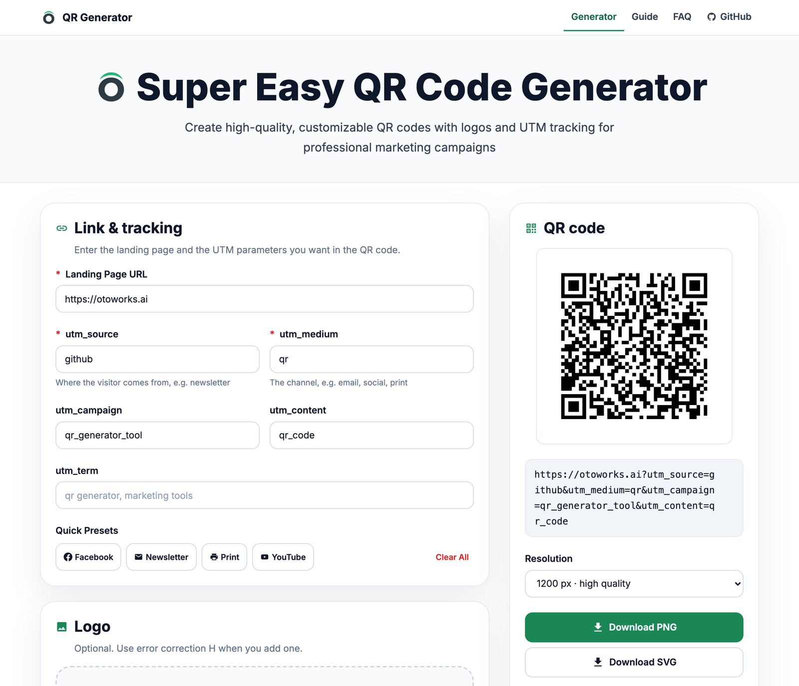

[](LICENSE)
[](https://developer.mozilla.org/en-US/docs/Web/HTML)
[](https://developer.mozilla.org/en-US/docs/Web/CSS)
[](https://developer.mozilla.org/en-US/docs/Web/JavaScript)

# Super Easy QR Code Generator

> ***Create branded QR codes with UTM tracking in seconds***

[](https://nuung.github.io/qrcode-gen/)

<p align="center">
    
</p>

## Live Demo

> **[Try it now](https://nuung.github.io/qrcode-gen/)** — no sign-up, nothing leaves your browser.  
> Read the [Guide](https://nuung.github.io/qrcode-gen/guide.html) for UTM parameters and error correction levels, or the [FAQ](https://nuung.github.io/qrcode-gen/faq.html).

## Key Features

### 1) Super Simple Design

- Drop a logo into the middle of the code and size it with a slider  
- Foreground and background colors with a live preview  
- PNG export at 300, 600, 900 or 1200 px, or SVG for print  

### 2) Complete UTM Tracking

- Supports all 5 UTM parameters (source, medium, campaign, content, term)  
- Quick presets for Facebook, newsletter, print and YouTube campaigns  
- Live preview of the final URL with click-to-copy  
- Works with Google Analytics 4 or any tool that reads UTM parameters  

### 3) Advanced Customization

- Error correction levels L / M / Q / H (use H with a logo)  
- Adjustable QR version, cell size and quiet-zone margin  
- The download buttons sit next to the preview, so there is no hunting for them  

### 4) Production Ready

- Runs entirely in the browser: no server, no upload, no account  
- Responsive from phones to wide desktops; on phones the preview and download buttons come first  
- Built to WCAG 2.1 AA targets (landmarks, skip link, visible focus rings, 44px touch targets)  
- Lighthouse 97–100 on performance, accessibility, best practices and SEO  

## Ideal For

- Digital marketers  
- Print designers  
- Event organizers  
- Content creators  
- Small businesses  
- Anyone who prints a link  

## Quick Start

1. Open [nuung.github.io/qrcode-gen](https://nuung.github.io/qrcode-gen/)  
2. Paste your landing page URL and fill in the UTM parameters (or pick a preset)  
3. Upload a logo (optional) and choose error correction H if you did  
4. Adjust colors, size and margin  
5. Download PNG or SVG  

## Use Cases

### 1) Marketing Campaigns

- Print ads with trackable QR codes  
- Social media attribution  
- Email performance tracking  
- Event sign-up systems  

### 2) Business Applications

- Digital business cards  
- Branded product packaging  
- Menu digitization  
- Creative portfolio links  

## Technical Highlights

- Plain HTML, CSS and JavaScript with no build step: three pages (`index.html`, `guide.html`, `faq.html`), one stylesheet, one script  
- One runtime dependency, `qrcode-generator` 1.4.4 from cdnjs, pinned with Subresource Integrity  
- Self-hosted Inter (four weights, woff2); no font CDN  
- Content Security Policy via `<meta>`, per-page canonical, Open Graph and JSON-LD (`WebApplication`, `HowTo`, `FAQPage`), `robots.txt`, `sitemap.xml`, `llms.txt`  
- Web app manifest and icons included  

## Why Use This Tool?

Compared to basic QR generators:

- Full UTM support for tracking marketing performance  
- Logo overlay with an error-correction level that keeps the code scannable  
- Print-ready resolution and vector export  
- Instant preview while you type  
- All data handled locally for privacy  
- Works the same on mobile and desktop  

## Links

- **Tool**: [nuung.github.io/qrcode-gen](https://nuung.github.io/qrcode-gen/)  
- **Guide**: [nuung.github.io/qrcode-gen/guide.html](https://nuung.github.io/qrcode-gen/guide.html)  
- **FAQ**: [nuung.github.io/qrcode-gen/faq.html](https://nuung.github.io/qrcode-gen/faq.html)  
- **Code**: [github.com/Nuung/qrcode-gen](https://github.com/Nuung/qrcode-gen)  
- **Feedback**: [GitHub Issues](https://github.com/Nuung/qrcode-gen/issues)

## Development

There is nothing to install. Clone the repository and serve the folder:

```bash
git clone https://github.com/Nuung/qrcode-gen.git
cd qrcode-gen
python3 -m http.server 8080
```

Then open `http://localhost:8080/`. Design tokens and component rules live in `DESIGN.md`; working rules and verification gates live in `AGENTS.md`.

## License

MIT License – free for personal and commercial use.

---

**Built by [Nuung](https://www.linkedin.com/in/hyeonwoo-jeong-nuung/) — Made for marketers and creators**
